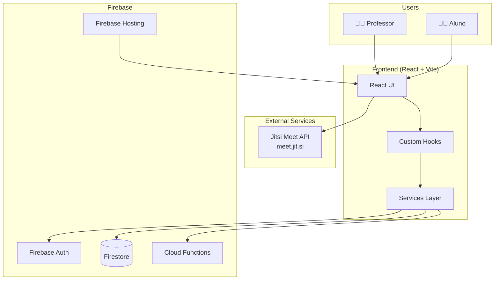
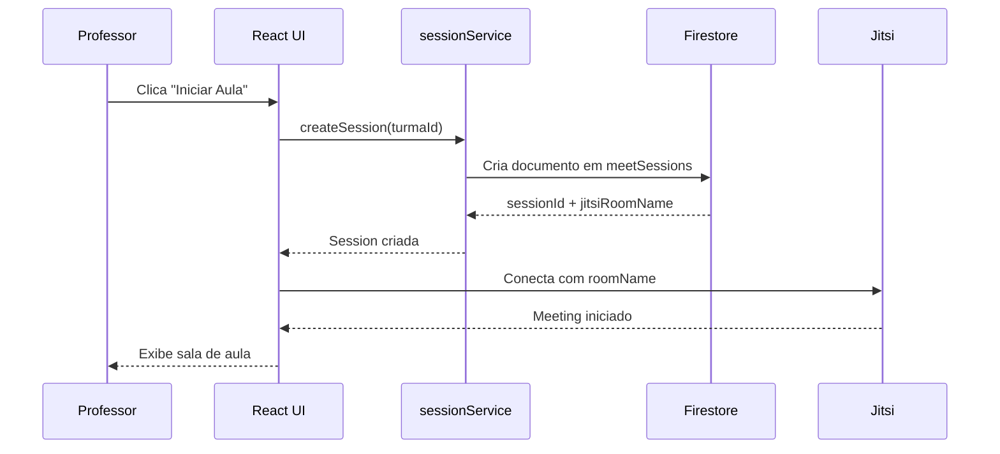
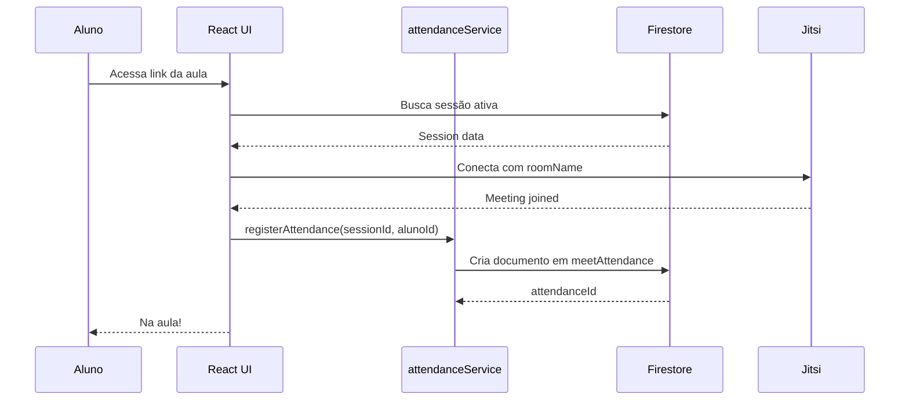
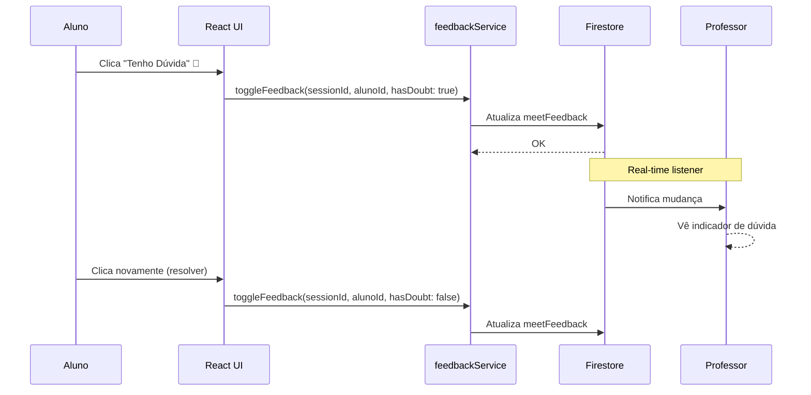
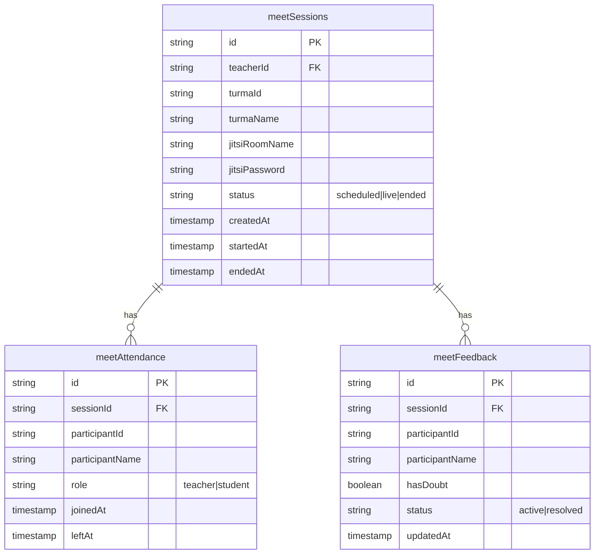
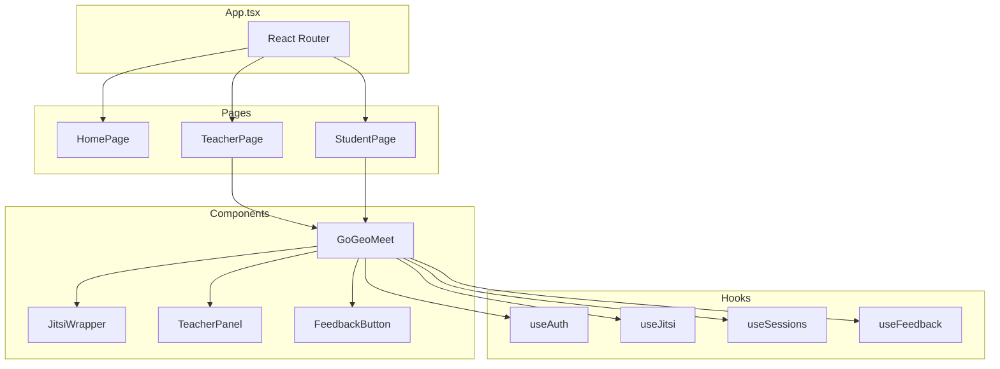

# 🏗️ ARCHITECTURE.md - Diagrama de Sistema

## Visão Geral do Sistema



---

## Fluxo: Professor Inicia Aula



---

## Fluxo: Aluno Entra na Aula



---

## Fluxo: Feedback Silencioso



---

## Firestore Collections



---

## Componentes React



---

## Integrações Externas

| Serviço              | URL           | Uso                           |
| -------------------- | ------------- | ----------------------------- |
| **Jitsi Meet**       | `meet.jit.si` | Videoconferência (custo zero) |
| **Firebase Auth**    | Google Cloud  | Autenticação de usuários      |
| **Firestore**        | Google Cloud  | Banco de dados NoSQL          |
| **Firebase Hosting** | Google Cloud  | Hospedagem do frontend        |

---

## Ports & Adapters

```
┌─────────────────────────────────────────────────────┐
│                    PRESENTATION                      │
│  React Components, Pages, Hooks                      │
├─────────────────────────────────────────────────────┤
│                    APPLICATION                       │
│  Services (sessionService, attendanceService, etc)   │
├─────────────────────────────────────────────────────┤
│                    INFRASTRUCTURE                    │
│  Firebase SDK, Jitsi API, Cloud Functions            │
└─────────────────────────────────────────────────────┘
```
