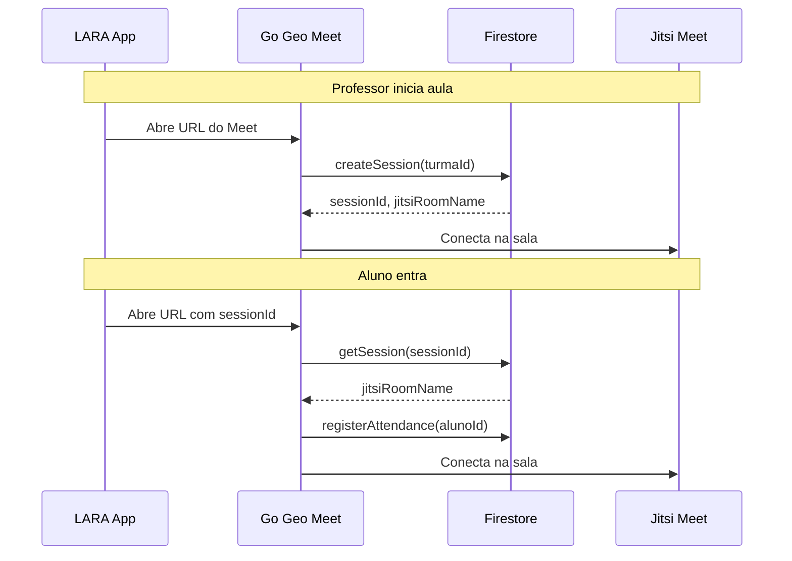

# 🔗 INTEGRATION.md - Integração com Ecossistema Go Geo

> Este documento descreve como o Go Geo Meet se integra ao ecossistema Go Geo Education.

---

## Identificação do Projeto

| Campo                 | Valor                        |
| --------------------- | ---------------------------- |
| **Nome**              | Go Geo Meet                  |
| **Source Identifier** | `"meet"`                     |
| **Firebase Project**  | `gogeo-synapse`              |
| **Hosting URL**       | `https://gogeo-meet.web.app` |

---

## Collections do Firestore

### Collections Próprias (Prefixo `meet*`)

| Collection       | Descrição             | Leitura | Escrita               |
| ---------------- | --------------------- | ------- | --------------------- |
| `meetSessions`   | Sessões de aula       | Público | Teacher autenticado   |
| `meetAttendance` | Registros de presença | Público | Qualquer participante |
| `meetFeedback`   | Feedback silencioso   | Público | Qualquer participante |

### Collections Compartilhadas (Leitura Apenas)

| Collection | Uso no Meet                       |
| ---------- | --------------------------------- |
| `users`    | Resolver nomes de professores     |
| `turmas`   | Resolver nomes de turmas (futuro) |

---

## Fluxo de Integração



---

## Formas de Integração

### 1. Componente React (Para Apps React)

```tsx
import { GoGeoMeet } from "@gogeo/meet";

<GoGeoMeet
  sessionId="session-xyz"
  roomName="GoGeo-MAT7A-abc123"
  displayName="João Silva"
  role="student"
  onMeetingEnd={() => navigate("/dashboard")}
/>;
```

### 2. IFrame (Para LARA App / HTML)

```html
<iframe
  src="https://gogeo-meet.web.app/student/room/GoGeo-MAT7A-abc123?name=João&sessionId=session-xyz"
  width="100%"
  height="600"
  allow="camera; microphone; display-capture; autoplay"
  style="border: none;"
></iframe>
```

### 3. Direct Link (Para WhatsApp / Email)

```
https://gogeo-meet.web.app/student/room/{roomName}?name={alunoName}&sessionId={sessionId}
```

---

## Eventos Emitidos

O Go Geo Meet pode emitir eventos para a aplicação host:

| Evento       | Payload                       | Descrição           |
| ------------ | ----------------------------- | ------------------- |
| `onReady`    | `{ sessionId, roomName }`     | Meeting pronto      |
| `onJoin`     | `{ participantId, name }`     | Participante entrou |
| `onLeave`    | `{ participantId, duration }` | Participante saiu   |
| `onFeedback` | `{ alunoId, hasDoubt }`       | Feedback alterado   |
| `onEnd`      | `{ sessionId, duration }`     | Meeting encerrado   |

---

## Dados Sincronizados

### Da plataforma para o Meet

| Dado              | Collection | Uso                   |
| ----------------- | ---------- | --------------------- |
| Nome do Professor | `users`    | Exibir no Jitsi       |
| Nome da Turma     | `turmas`   | Título da sessão      |
| Lista de Alunos   | `students` | Validar participantes |

### Do Meet para a plataforma

| Dado                 | Collection                         | Uso                    |
| -------------------- | ---------------------------------- | ---------------------- |
| Registro de Presença | `meetAttendance`                   | Relatórios             |
| Duração na Aula      | `meetAttendance.leftAt - joinedAt` | Estatísticas           |
| Feedback             | `meetFeedback`                     | Dashboard do professor |

---

## Regras de Negócio Compartilhadas

1. **Uma sessão ativa por turma**: Não criar nova sessão se já existe uma `live`
2. **Presença válida**: Mínimo 5 minutos para contar como presente
3. **Cleanup automático**: Sessões `scheduled` há mais de 24h são arquivadas

---

## URLs e Rotas

| Rota                      | Descrição              | Acesso       |
| ------------------------- | ---------------------- | ------------ |
| `/`                       | Login/Home             | Público      |
| `/teacher/dashboard`      | Dashboard do professor | Autenticado  |
| `/teacher/room/:roomName` | Sala do professor      | Autenticado  |
| `/student/room/:roomName` | Sala do aluno          | Semi-público |

---

## Variáveis de Ambiente

```env
# Firebase
VITE_FIREBASE_API_KEY=xxx
VITE_FIREBASE_AUTH_DOMAIN=gogeo-synapse.firebaseapp.com
VITE_FIREBASE_PROJECT_ID=gogeo-synapse

# Jitsi
VITE_JITSI_DOMAIN=meet.jit.si

# API (se usando Cloud Functions)
VITE_API_BASE_URL=https://us-central1-gogeo-synapse.cloudfunctions.net
```

---

## Troubleshooting de Integração

| Problema           | Causa                      | Solução                                |
| ------------------ | -------------------------- | -------------------------------------- |
| CORS error         | API não permite origem     | Adicionar domínio ao allowlist         |
| Auth não funciona  | Projeto Firebase diferente | Usar mesmo projeto `gogeo-synapse`     |
| Dados não aparecem | Collection errada          | Verificar prefixo `meet*`              |
| IFrame em branco   | Permissões faltando        | Adicionar `allow="camera; microphone"` |
